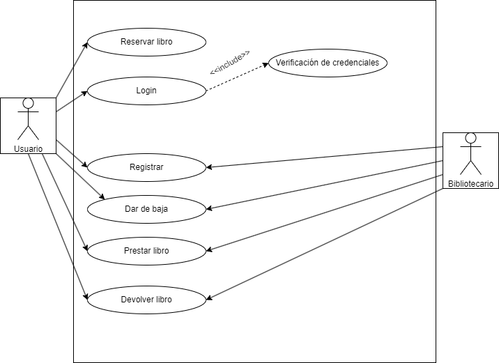

# 
CASOS DE USO BIBLIOTECA

## Diagrama de casos de uso

## Actores

| Descripción del actor | Usuario |
| ---                   | ---     |
| Descripción           | El Usuario es todo aquel que interactua con la aplicación de la biblioteca, para acceder a los servicios que ofrece, la información que alberga y gestionar la que le permita el sistema. |
| Características       | Interacción con la biblioteca (Reservas, préstamos, devoluciones), Autentificación (Login, Registro, Baja). |
| Relaciones            | Bibliotecario, Sistema |
| Referencias           | Perfil personal        |
| Atributos             | Credenciales de login  |

| Descripción del actor | Bibliotecario |
| ---                   | ---           |
| Descripción           | El bibliotecario hace las veces de administrador y encargado de la biblioteca física. |
| Características       | Interacción con el usuario (Prestar, devolver), gestión de cuentas (Registrar, Dar de baja). |
| Relaciones            | Usuario, Sistema. |
| Referencias           | Perfil de administrador |
| Atributos             | Credenciales de  administrador |

## Casos de uso

### Reservar libro
<table>
  <thead>
    <tr>
      <th>Reserva</th>
      <th>Biblioteca</th>
    </tr>
  </thead>
  <tbody>
    <tr>
      <td>Actores</td>
      <td>Usuario</td>
    </tr>
    <tr>
      <td>Descripción</td>
      <td>Este caso de uso se basa en la necesidad de reservar libros, para que posteriormente el usuario pueda coger prestado el libro en la biblioteca, asegurándose así de que se encuentra disponible.</td>
    </tr>
    <tr>
      <td>Condiciones previas</td>
      <td>
        <ul>
          <li>Estar registrado con una cuenta en la aplicación de la biblioteca.</li>
          <li>Estar logueado en la cuenta en la que se pretenda realizar la reserva.</li>
          <li>El usuario debe disponer de una manera de hacer la búsqueda del libro que desea reservar.</li>
          <li>Se debe verificar la disponibilidad del libro antes de que al usuario se le permita proceder con la reserva.</li>
        </ul>
      </td>
    </tr>
    <tr>
      <td>Flujo principal</td>
      <td>
        <ol>
          <li>Cuando el usuario vaya a reservar un libro, deberá pinchar en el botón de "reservar", esto lo llevará a la página de la reserva.</li>
          <li>En esta página deberá de introducir los datos de cuando desea retirar el libro seleccionado de la biblioteca, datos que se unirán a sus datos personales de la cuenta, para identificar a la persona que va a retirar el libro.</li>
        </ol>
      </td>
    </tr>
    <tr>
      <td>Condiciones posteriores</td>
      <td>Al usuario se le deberá proporcionar un ID único, relacionado a su reserva, este ID identificará su reserva y lo deberá presentar ante el bibliotecario en persona, para retirar el libro.</td>
    </tr>
    <tr>
      <td>Flujo alterno o excepciones</td>
      <td>
        <ol>
          <li><b>Paso 1:</b> Si no está disponible el libro para reservar, el botón de la reserva no se podrá accionar. En caso de que el libro no esté disponible para una fecha concreta seleccionada, el usuario recibirá feedback a través de mensajes y colores diferentes en la interfaz que le avisarán de que debe elegir otra fecha pues esa ya ha sido escogida.</li>
        </ol>
      </td>
    </tr>
  </tbody>
</table>

</body>
</html>

### Prestar libro
<table>
  <thead>
    <tr>
      <th>Prestar</th>
      <th>Biblioteca</th>
    </tr>
  </thead>
  <tbody>
    <tr>
      <td>Actores</td>
      <td>Usuario, Bibliotecario</td>
    </tr>
    <tr>
      <td>Descripción</td>
      <td>Este caso de uso es el que tiene que ver con la acción principal de la biblioteca, que será la de dar a los usuarios libros prestados durante un tiempo.</td>
    </tr>
    <tr>
      <td>Condiciones previas</td>
      <td>
        <ul>
          <li>El usuario se debe haber registrado previamente en la aplicación de la biblioteca.</li>
          <li>El libro debe estar solicitado y disponible o reservado por el usuario.</li>
        </ul>
      </td>
    </tr>
    <tr>
      <td>Flujo principal</td>
      <td>
        <ol>
          <li>El usuario se identifica con sus credenciales.</li>
          <li>Solicita el préstamo del libro a través de reserva o de disponibilidad actual del mismo.</li>
          <li>El bibliotecario busca en el catálogo la disponibilidad del mismo, o verifica la existencia de la reserva.</li>
          <li>El bibliotecario registra el préstamo y entrega el libro al usuario.</li>
          <li>Se notifica al usuario la fecha límite de devolución.</li>
        </ol>
      </td>
    </tr>
    <tr>
      <td>Condiciones posteriores</td>
      <td>
        <ul>
          <li>El sistema registra el libro como prestado.</li>
          <li>El historial de préstamos del usuario se actualiza con el último préstamo.</li>
        </ul>
      </td>
    </tr>
    <tr>
      <td>Flujo alterno o excepciones</td>
      <td>
        <ol>
          <li><b>Paso 2:</b> El libro no se puede prestar porque no está disponible.</li>
        </ol>
      </td>
    </tr>
  </tbody>
</table>

### Devolver libro
<table>
  <thead>
    <tr>
      <th>Devolver</th>
      <th>Biblioteca</th>
    </tr>
  </thead>
  <tbody>
    <tr>
      <td>Actores</td>
      <td>Usuario, Bibliotecario</td>
    </tr>
    <tr>
      <td>Descripción</td>
      <td>Este es el caso de uso que describe la devolución de un libro por parte de un usuario.</td>
    </tr>
    <tr>
      <td>Condiciones previas</td>
      <td>
        <ul>
          <li>El usuario deberá tener un libro prestado en activo.</li>
          <li>El plazo de devolución no debe haber concluido.</li>
        </ul>
      </td>
    </tr>
    <tr>
      <td>Flujo principal</td>
      <td>
        <ol>
          <li>El usuario se debe identificar con sus credenciales.</li>
          <li>El bibliotecario busca el libro que se va a devolver.</li>
          <li>El bibliotecario registra la devolución del libro.</li>
          <li>El usuario recibe una notificación de devolución exitosa.</li>
        </ol>
      </td>
    </tr>
    <tr>
      <td>Condiciones posteriores</td>
      <td>Se vuelve a marcar el libro como disponible para préstamo.</td>
    </tr>
    <tr>
      <td>Flujo alterno o excepciones</td>
      <td>
        <ol>
          <li>Si el usuario se retrasa en la devolución del libro, deberá abonar un cargo por el tiempo de retraso.</li>
          <li><b>Paso 3:</b> Si el libro está dañado, se deberá abonar el importe de un libro nuevo y el libro devuelto no se pondrá de nuevo en el sistema como disponible para su préstamo.</li>
        </ol>
      </td>
    </tr>
  </tbody>
</table>

### Registrarse

<table>
  <thead>
    <tr>
      <th>Registro</th>
      <th>Biblioteca</th>
    </tr>
  </thead>
  <tbody>
    <tr>
      <td>Actores</td>
      <td>Usuario, Bibliotecario</td>
    </tr>
    <tr>
      <td>Descripción</td>
      <td>El usuario deberá registrarse en la aplicación para acceder a sus funciones. Por supuesto, el usuario también podrá ser registrado por el bibliotecario, que funcionará a efectos de administrador.</td>
    </tr>
    <tr>
      <td>Condiciones previas</td>
      <td>
        <ul>
          <li>Si el usuario se quiere registrar no deberá estar registrado.</li>
        </ul>
      </td>
    </tr>
    <tr>
      <td>Flujo principal</td>
      <td>
        <ol>
          <li>Se entra en la plataforma de registro.</li>
          <li>Se introducen los datos solicitados.</li>
          <li>Se guardan los datos y credenciales en la base de datos.</li>
          <li>El usuario obtiene acceso a su nueva cuenta.</li>
        </ol>
      </td>
    </tr>
    <tr>
      <td>Condiciones posteriores</td>
      <td>El usuario deberá tener acceso a todas las funciones relacionadas a su estatus.</td>
    </tr>
    <tr>
      <td>Flujo alterno o excepciones</td>
      <td>
        <ol>
          <li><b>Paso 2:</b> Si el usuario introduce datos erróneos en el registro, se le pedirá que los ingrese de forma correcta.</li>
          <li><b>Paso 3:</b> No se puede registrar un usuario que ya está creado.</li>
        </ol>
      </td>
    </tr>
  </tbody>
</table>

### Dar de baja
<table>
  <thead>
    <tr>
      <th>Baja</th>
      <th>Biblioteca</th>
    </tr>
  </thead>
  <tbody>
    <tr>
      <td>Actores</td>
      <td>Usuario, Bibliotecario</td>
    </tr>
    <tr>
      <td>Descripción</td>
      <td>Un usuario podrá darse de baja de su cuenta, o el bibliotecario siguiendo tanto los deseos del usuario como siguiendo las directrices de la biblioteca, puede dar de baja a un usuario.</td>
    </tr>
    <tr>
      <td>Condiciones previas</td>
      <td>Deberá estar registrado el usuario que se quiera dar de baja.</td>
    </tr>
    <tr>
      <td>Flujo principal</td>
      <td>
        <ol>
          <li>Se entra en ajustes, en la sección de borrar cuenta.</li>
          <li>Se pincha el botón de "eliminar cuenta".</li>
          <li>Se debe confirmar.</li>
          <li>El usuario pierde acceso a la misma, al dejar de existir.</li>
        </ol>
      </td>
    </tr>
    <tr>
      <td>Condiciones posteriores</td>
      <td>Se liberará el nombre de usuario, volviendo a poder usarse.</td>
    </tr>
    <tr>
      <td>Flujo alterno o excepciones</td>
      <td>
        <ol>
          <li><b>Paso 3:</b> Si no se introduce bien la contraseña, el proceso de eliminación se cancelará y deberá volver a iniciarse.</li>
        </ol>
      </td>
    </tr>
  </tbody>
</table>

### Login
<table>
  <thead>
    <tr>
      <th>Login</th>
      <th>Biblioteca</th>
    </tr>
  </thead>
  <tbody>
    <tr>
      <td>Actores</td>
      <td>Usuario</td>
    </tr>
    <tr>
      <td>Descripción</td>
      <td>El login será la acción de acceder a una cuenta ya creada a través del proporcionamiento al sistema de unas credenciales para su verificación.</td>
    </tr>
    <tr>
      <td>Condiciones previas</td>
      <td>El usuario deberá estar registrado en la aplicación de la biblioteca. Una base de datos que haya guardado las credenciales que se introdujeron durante el registro.</td>
    </tr>
    <tr>
      <td>Flujo principal</td>
      <td>
        <ol>
          <li>El usuario entrará a la sección de la aplicación donde se realiza la acción del login.</li>
          <li>El usuario introduce sus credenciales y confirma el envío de las mismas para ser cotejadas por el sistema.</li>
          <li>Si los datos coinciden con alguna entrada de la base de datos, se lo dejará entrar con la cuenta asociada a esas credenciales.</li>
        </ol>
      </td>
    </tr>
    <tr>
      <td>Condiciones posteriores</td>
      <td>El usuario debe obtener acceso a su cuenta tal y como se dejó la última vez que accedió.</td>
    </tr>
    <tr>
      <td>Flujo alterno o excepciones</td>
      <td>
        <ol>
          <li><b>Paso 3:</b> Si las credenciales introducidas son erróneas, el sistema mostrará un mensaje de error indicando al usuario que sus credenciales no coinciden.</li>
          <li><b>Paso 2:</b> El login falla y el usuario debe volver a proporcionar credenciales.</li>
        </ol>
      </td>
    </tr>
    <tr>
      <td>Include</td>
      <td>Verificación de credenciales</td>
    </tr>
  </tbody>
</table>
 

