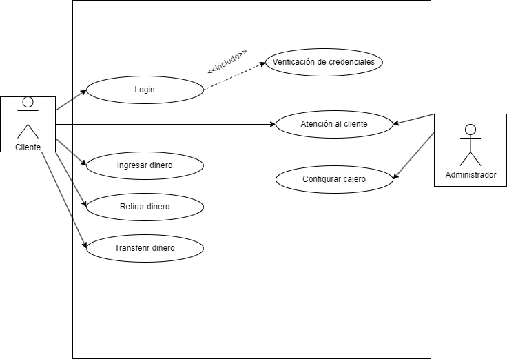

# 
Casos de Uso Cajero ATM

## Diagrama de casos de uso

## Actores
| Descripción del actor | Administrador |
| ---                   | ---           |
| Descripción           | El administrador será la persona que se encargue de revisar y administrar el cajero. |
| Características       | El administrador tendrá un acceso de alto nivel y podrá hacer cambios en la configuración y solucionar problemas técnicos. |
| Relaciones            | Cliente, Sistema. |
| Referencias           | "Configurar cajero", "Atención al cliente" |
| Atributos             | Perfil de administrador. |

| Descripción del actor | Cliente bancario |
| ---                   | ---              |
| Descripción           | El cliente bancario será el usuario de la aplicación que tiene una cuenta en el banco y que accederá a las funciones del cajero para hacer gestiones y movimientos de dinero. |
| Características       | El usuario tiene un acceso que le da capacidad de usar las funciones de las que dispone el cajero, como ingresar, retirar o transferir dinero, por ejemplo. |
| Relaciones            | Administrador, Sistema. |
| Referencias           | "Ingresar dinero", "retirar dinero", "transferir dinero", "Atención al cliente", "Login" |
| Atributos             | Credenciales bancarias |

## Casos de uso

### Configurar cajero
<table>
  <thead>
    <tr>
      <th>Configuración</th>
      <th>Cajero</th>
    </tr>
  </thead>
  <tbody>
    <tr>
      <td>Actores</td>
      <td>Administrador</td>
    </tr>
    <tr>
      <td>Descripción</td>
      <td>Se tiene que configurar el cajero para que funcione correctamente.</td>
    </tr>
    <tr>
      <td>Condiciones previas</td>
      <td>El cajero debe estar fuera de servicio. Se debe tener acceso al sistema del cajero.</td>
    </tr>
    <tr>
      <td>Flujo principal</td>
      <td>
        <ol>
          <li>Se entra a la configuración en el panel de control del cajero.</li>
          <li>Se realizan los cambios necesarios (Actualizaciones, reabastecimiento, reparaciones, etc).</li>
          <li>Se guardan los cambios, si es necesario.</li>
        </ol>
      </td>
    </tr>
    <tr>
      <td>Condiciones posteriores</td>
      <td>El cajero automático ha sido configurado y vuelve a estar en servicio.</td>
    </tr>
    <tr>
      <td>Flujo alterno o excepciones</td>
      <td>
        <ol>
          <li><b>Paso 2:</b> Si durante la configuración el cajero tiene un error, se restaura la configuración previa.</li>
        </ol>
      </td>
    </tr>
  </tbody>
</table>

### Atención al cliente
<table>
  <thead>
    <tr>
      <th>Configuración</th>
      <th>Cajero</th>
    </tr>
  </thead>
  <tbody>
    <tr>
      <td>Actores</td>
      <td>Administrador, Cliente</td>
    </tr>
    <tr>
      <td>Descripción</td>
      <td>El cliente puede ponerse en contacto con la administración para resolver dudas y problemas.</td>
    </tr>
    <tr>
      <td>Condiciones previas</td>
      <td>El cliente debe tener una cuenta en la entidad bancaria del cajero que está provocando problemas. Existe un problema que resolver.</td>
    </tr>
    <tr>
      <td>Flujo principal</td>
      <td>
        <ol>
          <li>El cliente se pone en contacto con un administrador a través de los canales establecidos.</li>
          <li>El cliente indica el problema que tiene.</li>
          <li>El administrador consulta el problema.</li>
          <li>El administrador le ofrece al usuario una posible solución.</li>
          <li>El usuario decide si el problema se ha resuelto.</li>
        </ol>
      </td>
    </tr>
    <tr>
      <td>Condiciones posteriores</td>
      <td>El problema ha quedado resuelto.</td>
    </tr>
    <tr>
      <td>Flujo alterno o excepciones</td>
      <td>
        <ol>
          <li><b>Paso 5:</b> Si el problema no se soluciona el administrador deberá seguir ofreciendo todas las soluciones posibles para intentar solventarlo.</li>
        </ol>
      </td>
    </tr>
  </tbody>
</table>

### Login
<table>
  <thead>
    <tr>
      <th>Login</th>
      <th>Cajero</th>
    </tr>
  </thead>
  <tbody>
    <tr>
      <td>Actores</td>
      <td>Cliente</td>
    </tr>
    <tr>
      <td>Descripción</td>
      <td>El cliente al llegar al cajero deberá introducir un PIN secreto para acceder a su cuenta bancaria.</td>
    </tr>
    <tr>
      <td>Condiciones previas</td>
      <td>El cliente tiene que tener una cuenta bancaria y una tarjeta de crédito.</td>
    </tr>
    <tr>
      <td>Flujo principal</td>
      <td>
        <ol>
          <li>El cliente introduce su tarjeta en el cajero.</li>
          <li>El cajero le pide el PIN.</li>
          <li>Si el PIN es correcto se entra en la cuenta.</li>
        </ol>
      </td>
    </tr>
    <tr>
      <td>Condiciones posteriores</td>
      <td>El cliente ha accedido a su cuenta bancaria.</td>
    </tr>
    <tr>
      <td>Flujo alterno o excepciones</td>
      <td>
        <ol>
          <li><b>Paso 3:</b> Si el PIN es incorrecto se debe volver a introducir y se avisa al cliente del límite de intentos antes de bloquear la tarjeta.</li>
        </ol>
      </td>
    </tr>
    <tr>
      <td>Incluye</td>
      <td>Verificación de credenciales</td>
    </tr>
  </tbody>
</table>

### Ingresar dinero
<table>
  <thead>
    <tr>
      <th>Ingresar</th>
      <th>Cajero</th>
    </tr>
  </thead>
  <tbody>
    <tr>
      <td>Actores</td>
      <td>Cliente</td>
    </tr>
    <tr>
      <td>Descripción</td>
      <td>El cliente podrá meter dinero en su cuenta a través de un cajero.</td>
    </tr>
    <tr>
      <td>Condiciones previas</td>
      <td>Se debe haber hecho login en un cajero.</td>
    </tr>
    <tr>
      <td>Flujo principal</td>
      <td>
        <ol>
          <li>El cliente entra a la sección de "Ingresar dinero".</li>
          <li>Se selecciona la forma de ingreso (Efectivo, cheque...).</li>
          <li>El cajero cuenta el dinero y se añade la cantidad a la cuenta.</li>
        </ol>
      </td>
    </tr>
    <tr>
      <td>Condiciones posteriores</td>
      <td>El cantidad de dinero exacta se ha sumado a la cuenta del cliente.</td>
    </tr>
    <tr>
      <td>Flujo alterno o excepciones</td>
      <td>
        <ol>
          <li>Si el cajero se encuentra fuera de servicio no se podrá usar.</li>
          <li><b>Paso 3:</b> Si el cajero es incapaz de contar el dinero con la forma de ingreso indicada se devuelve al cliente para que lo intente otra vez de forma correcta.</li>
        </ol>
      </td>
    </tr>
  </tbody>
</table>

### Retirar dinero
<table>
  <thead>
    <tr>
      <th>Retirar</th>
      <th>Cajero</th>
    </tr>
  </thead>
  <tbody>
    <tr>
      <td>Actores</td>
      <td>Cliente</td>
    </tr>
    <tr>
      <td>Descripción</td>
      <td>El cliente podrá retirar dinero en efectivo de su cuenta a través del cajero.</td>
    </tr>
    <tr>
      <td>Condiciones previas</td>
      <td>El cliente se debe haber logueado en el cajero.</td>
    </tr>
    <tr>
      <td>Flujo principal</td>
      <td>
        <ol>
          <li>El cliente entra a la sección de "Retirar dinero".</li>
          <li>Se selecciona cuanto dinero se desea retirar.</li>
          <li>El cajero da el dinero solicitado y se resta de la cuenta.</li>
        </ol>
      </td>
    </tr>
    <tr>
      <td>Condiciones posteriores</td>
      <td>El dinero se le ha dado al cliente y se ha restado de la cuenta bancaria.</td>
    </tr>
    <tr>
      <td>Flujo alterno o excepciones</td>
      <td>
        <ol>
          <li>Si el cajero se encuentra fuera de servicio no se podrá usar.</li>
          <li><b>Paso 2:</b> Si no el cajero no dispone de tal cantidad se le hace saber al cliente y se lo manda a la pantalla de inicio.</li>
          <li><b>Paso 3:</b> Si el cajero no da el dinero pero lo resta de la cuenta, es necesario ponerse en contacto con un administrador.</li>
        </ol>
      </td>
    </tr>
  </tbody>
</table>

### Transferir dinero
<table>
  <thead>
    <tr>
      <th>Transferir</th>
      <th>Cajero</th>
    </tr>
  </thead>
  <tbody>
    <tr>
      <td>Actores</td>
      <td>Cliente</td>
    </tr>
    <tr>
      <td>Descripción</td>
      <td>Los clientes pueden enviar dinero a las cuentas de otros clientes mediante transferencia en cajero.</td>
    </tr>
    <tr>
      <td>Condiciones previas</td>
      <td>El cliente debe estar logueado en el cajero. La persona a la que se va transferir dinero debe tener cuenta bancaria válida.</td>
    </tr>
    <tr>
      <td>Flujo principal</td>
      <td>
        <ol>
          <li>El cliente selecciona la opción de "Transferencia bancaria".</li>
          <li>Se indica el código de cuenta a la que se quiere transferir el dinero.</li>
          <li>Se indica la cantidad a transferir.</li>
          <li>Se confirma la transferencia.</li>
          <li>El dinero se resta de una cuenta y se suma a la otra.</li>
        </ol>
      </td>
    </tr>
    <tr>
      <td>Condiciones posteriores</td>
      <td>El dinero se ha transferido entre cuentas satisfactoriamente. Se genera un registro de transferencia bancaria.</td>
    </tr>
    <tr>
      <td>Flujo alterno o excepciones</td>
      <td>
        <ol>
          <li>Si el cajero se encuentra fuera de servicio no se podrá usar.</li>
          <li><b>Paso 2:</b> Si el código de cuenta es erroneo se muestra un mensaje de error y se vuelve a pedir.</li>
          <li><b>Paso 3:</b> Si no se dispone de tal cantidad en la cuenta, no se transferirá el dinero y saltará un mensaje de error.</li>
          <li><b>Paso 4:</b> Si el cliente no confirma la operación se cancelará.</li>
        </ol>
      </td>
    </tr>
  </tbody>
</table>

