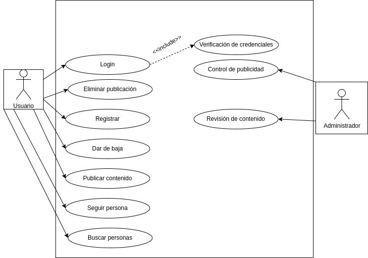

# 
Casos de uso Red Social

## Diagrama de casos de uso

## Actores
| Descrición del actor | Usuario |
| ---                  | ---     |
| Descripción          | Los usuarios serán las personas que interactuen entre sí en la red social publicando contenido y comentándolas. |
| Características      | Interacción con la red social (Publicar, eliminar, etc). Interacción con el sistema (Registro, baja, login). Interacción con usuarios (amigos)  |
| Relaciones           | Administrador, Sistema. |
| Referencias          | Perfil de usuario |
| Atributos            | Credenciales de usuario, Datos del perfil de usuario |

| Descripción del actor | Administrador |
| ---                   | ---           |
| Descripción           | Los administradores se encargarán de mantener el funcionamiento correcto y el cumplimiento de las normas de la red social. |
| Características       | Moderación de la Red Social (Revisar, eliminar publicaciones). Control de experiencia (Publicidad). |
| Relaciones            | Usuario, Sistema. |
| Referencias           | Perfil de administrador |
| Atributos             | Credenciales de administrador |

## Casos de uso

### Registrarse
<table>
  <thead>
    <tr>
      <th>Registro</th>
      <th>Red social</th>
    </tr>
  </thead>
  <tbody>
    <tr>
      <td>Actores</td>
      <td>Usuario</td>
    </tr>
    <tr>
      <td>Descripción</td>
      <td>El usuario deberá registrarse en la aplicación para poder interactuar con otras personas en la red social.</td>
    </tr>
    <tr>
      <td>Condiciones previas</td>
      <td>Si el usuario se quiere registrar no deberá estar registrado.</td>
    </tr>
    <tr>
      <td>Flujo principal</td>
      <td>
        <ol>
          <li>Se entra en la plataforma de registro.</li>
          <li>Se introducen los datos solicitados.</li>
          <li>Se guardan los datos y credenciales en la base de datos.</li>
          <li>El usuario obtiene acceso a su nueva cuenta.</li>
        </ol>
      </td>
    </tr>
    <tr>
      <td>Condiciones posteriores</td>
      <td>El usuario deberá tener acceso a todas las funciones relacionadas a su estatus.</td>
    </tr>
    <tr>
      <td>Flujo alterno o excepciones</td>
      <td>
        <ol>
          <li><b>Paso 2:</b> Si el usuario introduce datos erróneos en el registro se le pedirá que los ingrese de forma correcta.</li>
          <li><b>Paso 3:</b> No se puede registrar un usuario que ya está creado. Se volverá a la pantalla de registro.</li>
        </ol>
      </td>
    </tr>
  </tbody>
</table>

### Darse de baja
<table>
  <thead>
    <tr>
      <th>Baja</th>
      <th>Red Social</th>
    </tr>
  </thead>
  <tbody>
    <tr>
      <td>Actores</td>
      <td>Usuario</td>
    </tr>
    <tr>
      <td>Descripción</td>
      <td>Un usuario podrá dar de baja su cuenta</td>
    </tr>
    <tr>
      <td>Condiciones previas</td>
      <td>Deberá estar registrado el usuario que se quiera dar de baja.</td>
    </tr>
    <tr>
      <td>Flujo principal</td>
      <td>
        <ol>
          <li>Se entra en ajustes, en la sección de borrar cuenta.</li>
          <li>Se pincha el botón de "eliminar cuenta".</li>
          <li>Se debe confirmar.</li>
          <li>La cuenta se borra por completo junto con sus datos, publicaciones y comentarios y deja de existir.</li>
        </ol>
      </td>
    </tr>
    <tr>
      <td>Condiciones posteriores</td>
      <td> Se liberaran las credenciales de la cuenta puediendo reutilizarse en otras.</td>
    </tr>
    <tr>
      <td>Flujo alterno o excepciones</td>
      <td>
        <ol>
          <li><b>Paso 3:</b> Si el usuario se arrepiente antes de confirmar la eliminación podrá elegir cancelar el proceso.</li>
        </ol>
      </td>
    </tr>
  </tbody>
</table>

### Login
<table>
  <thead>
    <tr>
      <th>Login</th>
      <th>Red Social</th>
    </tr>
  </thead>
  <tbody>
    <tr>
      <td>Actores</td>
      <td>Usuario</td>
    </tr>
    <tr>
      <td>Descripción</td>
      <td>El login será la acción de acceder a una cuenta ya creada a través del proporcionamiento al sistema de unas credenciales para su verificación.</td>
    </tr>
    <tr>
      <td>Condiciones previas</td>
      <td>El usuario tiene que estar registrado en la Red social. Una base de datos debe haber guardado las credenciales que se introdujeron durante el registro.</td>
    </tr>
    <tr>
      <td>Flujo principal</td>
      <td>
        <ol>
          <li>El usuario tiene que entrar a la sección de la aplicación donde se realiza el login.</li>
          <li>El usuario indicará sus credenciales y confirma que desea entrar.</li>
          <li>Se verifican las credenciales y si los datos coinciden con el usuario de la cuenta, se le permite entrar.</li>
        </ol>
      </td>
    </tr>
    <tr>
      <td>Condiciones posteriores</td>
      <td>El usuario debe obtener acceso a su cuenta y tener una serie de notificaciones que correspondan a su ausencia.</td>
    </tr>
    <tr>
      <td>Flujo alterno o excepciones</td>
      <td>
        <ol>
          <li><b>Paso 3:</b> Si las credenciales introducidas son erróneas, el sistema mostrará un mensaje de error indicando al usuario que sus credenciales no coinciden.</li>
          <li><b>Paso 3:</b> El login falla y el usuario debe volver a proporcionar credenciales.</li>
        </ol>
      </td>
    </tr>
    <tr>
      <td>Include</td>
      <td>Verificación de credenciales</td>
    </tr>
  </tbody>
</table>

### Revisión de contenido
| Revisión | Red Social |
| ---      | ---        |
| Actores  | Administrador |
| Descripción | El administrador deberá revisar manualmente las alertas que le ha mandado el sistema para confirmar si se trata de un contenido prohibido en las políticas de la plataforma. |
| Condiciones previas | El sistema debe haber detectado contenido que se deba revisar. |
| Flujo principal     | 1. El administrador entra al sistema. 2. Entra a la lista de las publicaciones pendientes de revisión. 3. Se selecciona una para revisar y se muestran los detalles de la misma. 4. Se decide si se incumple con las políticas y se elimina el contenido. |
| Condiciones posteriores | Se han tomado las acciones que correspondan. La publicación actualiza su estado en la red social. |
| Flujo alterno y excepciones | 1. Paso 1: No se puede entrar al sistema si la conexión no es posible. 2. Paso 2: No hay publicaciones que revisar. |

### Control de publicidad

### Eliminación de publicaciones
| Eliminación | Red Social |
| ---         | ---        |
| Actores     | Usuario |
| Descripción | La red social está en constante movimiento, por lo que la posibilidad de que borrar contenido es imprescindible. |
| Condiciones previas | Estar autentificado en el sistema como el usuario que ha hecho la publicación. Debe existir una publicación previa. |
| Flujo principal     | 1. El usuario inicia sesion (login). 2. Se va a la sección de "Mis publicaciones". 3. Se selecciona la publicación que se quiere eliminar. 4. Se selecciona en la publicación la opción de "eliminar". 5. El sistema elimina la publicación. |
| Condiciones posteriores | La publicación se ha borrado y ya no es posible acceder a ella, por parte de nadie. |
| Flujo alterno y excepciones | 1. Paso 5: Si por cualquier error el sistema no puede borrar la publicación se muestra un mensaje de error y no le ocurre nada. |

### Publicar contenido
| Publicación | Red Social |
| ---         | ---        |
| Actores     | Usuario |
| Descripción | Los usuarios interactuaran con la red social publicando contenido. |
| Condiciones previas | Estar previamente registrado. Haber iniciado sesión en una cuenta. |
| Flujo principal     | 1. Se llega hasta la página de inicio. 2. Se selecciona la opción de publicar. 3. Se introduce el contenido de lo que se va a publicar. 4. Se selecciona "compartir". 5. La red social publica el contenido. |
| Condiciones posteriores | La publicación es visible a los usuarios permitidos para verla. |
| Flujo alterno y excepciones | 1. Paso 5: Si el contenido se detecta como prohibido por la red social no se publicará. |

### Buscar personas
| Buscar personas | Red Social |
| ---             | ---        |
| Actores         | Usuario |
| Descripción     | |
| Condiciones previas | |
| Flujo principal     | |
| Condiciones posteriores | |
| Flujo alterno y excepciones | |

### Seguir personas
| seguir personas | Red Social |
| ---             | ---        |
| Actores         | Usuario |
| Descripción     | |
| Condiciones previas | |
| Flujo principal     | |
| Condiciones posteriores | |
| Flujo alterno y excepciones | |

