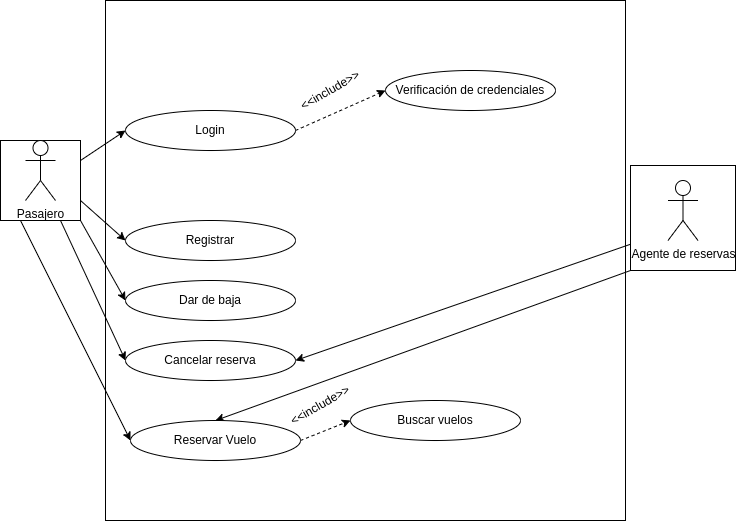

# 
Sistema de Reserva de Vuelos

## Diagrama de casos de uso

## Actores
| Descripción del actor | Pasajero |
| ---                   | ---      |
| Descripción           | El pasajero será el actor que actue con la aplicación para hacer uso de los servicios de aviación que en ella se ofrecen. |
| Características       | Interacción con la aplicación (Reservas, cancelaciones, busquedas), Autentificación (Registro, darse de baja, login).     |
| Relaciones            | Agente de reservas, sistema |
| Atributos             | Credenciales de Login |

| Descripción del actor | Agente de reservas  |
| ---                   | ---                 |
| Descripción           | El agente de reservas será aquella persona que atienda y asista al paseajero en su interacción con los servicios que ofrece la aplicación. |
| Características       | Interacción con la aplicación (Reservas, cancelaciones, busquedas). |
| Relaciones            | Pasajeros, sistemas |
| Atributos             | Datos de usuarios y reservas |

## Casos de uso

### Reservar Vuelo
<table>
  <thead>
    <tr>
      <th>Reservar vuelo</th>
      <th>App Reserva de Vuelos</th>
    </tr>
  </thead>
  <tbody>
    <tr>
      <td>Actores</td>
      <td>Pasajero, Agente de reservas</td>
    </tr>
    <tr>
      <td>Descripción</td>
      <td>Este es el caso de uso en el que un pasajero decide que quiere reservar un vuelo, el proceso será llevado a cabo por el pasajero o el gestor de reservas al que el pasajero le proporcione datos personales y requerimientos del vuelo deseado.</td>
    </tr>
    <tr>
      <td>Condiciones previas</td>
      <td>El pasajero debe estar registrado. El sistema de reservas debe estar operativo.</td>
    </tr>
    <tr>
      <td>Flujo principal</td>
      <td>
        <ol>
          <li>El pasajero inicia sesión en la aplicación de reservas.</li>
          <li>El pasajero selecciona la opción de reservas. Se busca según los parámetros deseados el vuelo.</li>
          <li>Selecciona el vuelo deseado.</li>
          <li>Se indica que se desea reservar.</li>
          <li>Se muestra un resumen de los datos del vuelo y su precio.</li>
          <li>Se confirma la reserva. Se crea el billete del vuelo con los datos del pasajero y se envía al mismo.</li>
        </ol>
      </td>
    </tr>
    <tr>
      <td>Condiciones posteriores</td>
      <td>La reserva en la compañía de vuelos debe estar a nombre del pasajero.</td>
    </tr>
    <tr>
      <td>Flujo alterno o excepciones</td>
      <td>
        <ol>
          <li><b>Paso 4:</b> Si no hay asientos disponibles en el vuelo en el momento de la reserva, se le informa al pasajero y se cancela la operación.</li>
        </ol>
      </td>
    </tr>
    <tr>
      <td>Include</td>
      <td>Buscar Vuelo</td>
    </tr>
  </tbody>
</table>

### Cancelar Reserva
<table>
  <thead>
    <tr>
      <th>Cancelar Reserva</th>
      <th>App Reserva de Vuelos</th>
    </tr>
  </thead>
  <tbody>
    <tr>
      <td>Actores</td>
      <td>Pasajero, Agente de reservas</td>
    </tr>
    <tr>
      <td>Descripción</td>
      <td>Este caso de uso está relacionado con la posibilidad y necesidad de cancelar una reserva debido a las circunstancias que obliguen al pasajero a ello. El agente de reservas podrá hacer este trabajo a petición del usuario.</td>
    </tr>
    <tr>
      <td>Condiciones previas</td>
      <td>El pasajero debe estar registrado. La sistema de reservas debe estar operativo. El pasajero debe tener una reserva activa.</td>
    </tr>
    <tr>
      <td>Flujo principal</td>
      <td>
        <ol>
          <li>El pasajero inicia la aplicación de reservas.</li>
          <li>El pasajero selecciona la opción de "Mis Reservas".</li>
          <li>El pasajero selecciona la reserva de vuelo que desea cancelar.</li>
          <li>El sistema muestra los detalles de la reserva seleccionada.</li>
          <li>El pasajero selecciona la opción de "Cancelar Reserva".</li>
          <li>El sistema solicita confirmación para la cancelación de la reserva.</li>
          <li>El pasajero confirma la cancelación de la reserva.</li>
          <li>El sistema procesa la cancelación y emite un reembolso.</li>
          <li>El pasajero recibe la confirmación de la cancelación y los detalles del reembolso.</li>
        </ol>
      </td>
    </tr>
    <tr>
      <td>Condiciones posteriores</td>
      <td>La reserva ha sido cancelada y el asiento vuelve a estar disponible. El reembolso se ha producido correctamente.</td>
    </tr>
    <tr>
      <td>Flujo alterno o excepciones</td>
      <td>
        <ol>
          <li><b>Paso 5:</b> Si por razones de políticas de cancelación u otros supuestos una reserva no se puede cancelar, el pasajero no podrá acceder a esta función para ese vuelo concreto.</li>
        </ol>
      </td>
    </tr>
  </tbody>
</table>

### Buscar Vuelo
<table>
  <thead>
    <tr>
      <th>Buscar vuelo</th>
      <th>App Reserva de Vuelos</th>
    </tr>
  </thead>
  <tbody>
    <tr>
      <td>Actores</td>
      <td>Pasajero, Agente de reservas</td>
    </tr>
    <tr>
      <td>Descripción</td>
      <td>Este caso de uso representará una funcionalidad de la aplicación que permitirá buscar vuelos que coincidan con las condiciones deseadas.</td>
    </tr>
    <tr>
      <td>Condiciones previas</td>
      <td>El pasajero debe estar registrado e iniciado en su cuenta. El servidor de la aplicación debe estar operativo.</td>
    </tr>
    <tr>
      <td>Flujo principal</td>
      <td>
        <ol>
          <li>El pasajero entra a la sección de buscar vuelos. Introduce los filtros que considere necesarios en los recuadros correspondientes, tales como destino, origen, fecha, precio, etc.</li>
          <li>El sistema coteja los resultados que cumplen esas condiciones.</li>
          <li>El pasajero los puede ver y escoger entre ellos.</li>
        </ol>
      </td>
    </tr>
    <tr>
      <td>Condiciones posteriores</td>
      <td>El pasajero puede acceder a los detalles completos de cada uno con una selección con el ratón o el teclado.</td>
    </tr>
    <tr>
      <td>Flujo alterno o excepciones</td>
      <td>
        <ol>
          <li><b>Paso 3:</b> Si no hay resultados que coincidan con la búsqueda se le hará saber al pasajero y se le mostrarán resultados similares.</li>
        </ol>
      </td>
    </tr>
    <tr>
      <td>Include</td>
      <td>Reservar vuelo</td>
    </tr>
  </tbody>
</table>

### Registrarse
<table>
  <thead>
    <tr>
      <th>Registro</th>
      <th>App Reserva de Vuelos</th>
    </tr>
  </thead>
  <tbody>
    <tr>
      <td>Actores</td>
      <td>Pasajero</td>
    </tr>
    <tr>
      <td>Descripción</td>
      <td>El pasajero deberá registrarse en la aplicación para poder empezar a buscar sus vuelos.</td>
    </tr>
    <tr>
      <td>Condiciones previas</td>
      <td>Si el pasajero se quiere registrar no deberá estar registrado.</td>
    </tr>
    <tr>
      <td>Flujo principal</td>
      <td>
        <ol>
          <li>Se entra en la plataforma de registro.</li>
          <li>Se introducen los datos solicitados.</li>
          <li>Se guardan los datos y credenciales en la base de datos.</li>
          <li>El pasajero obtiene acceso a su nueva cuenta.</li>
        </ol>
      </td>
    </tr>
    <tr>
      <td>Condiciones posteriores</td>
      <td>El pasajero deberá tener acceso a todas las funciones relacionadas con su estatus.</td>
    </tr>
    <tr>
      <td>Flujo alterno o excepciones</td>
      <td>
        <ol>
          <li><b>Paso 2:</b> Si el pasajero introduce datos erróneos en el registro se le pedirá que los ingrese de forma correcta.</li>
          <li><b>Paso 3:</b> No se puede registrar un pasajero que ya está creado.</li>
        </ol>
      </td>
    </tr>
  </tbody>
</table>

### Darse de baja
<table>
  <thead>
    <tr>
      <th>Baja</th>
      <th>App Reserva de Vuelos</th>
    </tr>
  </thead>
  <tbody>
    <tr>
      <td>Actores</td>
      <td>Pasajero</td>
    </tr>
    <tr>
      <td>Descripción</td>
      <td>Un pasajero podrá dar de baja su cuenta.</td>
    </tr>
    <tr>
      <td>Condiciones previas</td>
      <td>Deberá estar registrado el pasajero que se quiera dar de baja.</td>
    </tr>
    <tr>
      <td>Flujo principal</td>
      <td>
        <ol>
          <li>Se entra en ajustes, en la sección de borrar cuenta.</li>
          <li>Se pincha el botón de "eliminar cuenta".</li>
          <li>Se debe confirmar.</li>
          <li>La cuenta se borra por completo junto con sus datos y deja de existir.</li>
        </ol>
      </td>
    </tr>
    <tr>
      <td>Condiciones posteriores</td>
      <td>Se liberaran las credenciales de la cuenta pudiendo reutilizarse en otras.</td>
    </tr>
    <tr>
      <td>Flujo alterno o excepciones</td>
      <td>
        <ol>
          <li><b>Paso 3:</b> Si el pasajero se arrepiente antes de confirmar la eliminación podrá elegir cancelar el proceso.</li>
        </ol>
      </td>
    </tr>
  </tbody>
</table>

### Login
<table>
  <thead>
    <tr>
      <th>Login</th>
      <th>App Reserva de Vuelos</th>
    </tr>
  </thead>
  <tbody>
    <tr>
      <td>Actores</td>
      <td>Pasajero</td>
    </tr>
    <tr>
      <td>Descripción</td>
      <td>El login será la acción de acceder a una cuenta ya creada a través del proporcionamiento al sistema de unas credenciales para su verificación.</td>
    </tr>
    <tr>
      <td>Condiciones previas</td>
      <td>El pasajero tiene que estar registrado en la aplicación de reserva de vuelos. Una base de datos que haya guardado las credenciales que se introdujeron durante el registro.</td>
    </tr>
    <tr>
      <td>Flujo principal</td>
      <td>
        <ol>
          <li>El pasajero tiene que entrar a la sección de la aplicación donde se realiza el login.</li>
          <li>El pasajero indicará sus credenciales y confirma que desea entrar.</li>
          <li>Se verifican las credenciales y si los datos coinciden con el de el usuario de la cuenta del pasajero, se lo dejará entrar a la misma.</li>
        </ol>
      </td>
    </tr>
    <tr>
      <td>Condiciones posteriores</td>
      <td>El pasajero debe obtener acceso a su cuenta tal y como se dejó la última vez que accedió.</td>
    </tr>
    <tr>
      <td>Flujo alterno o excepciones</td>
      <td>
        <ol>
          <li><b>Paso 2:</b> Si las credenciales introducidas son erróneas, el sistema mostrará un mensaje de error indicando al usuario que sus credenciales no coinciden.</li>
          <li><b>Paso 3:</b> El login falla y el pasajero debe volver a proporcionar credenciales.</li>
        </ol>
      </td>
    </tr>
    <tr>
      <td>Include</td>
      <td>Verificación de credenciales</td>
    </tr>
  </tbody>
</table>

