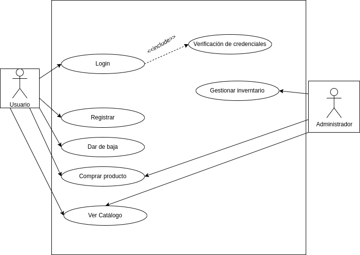

## Diagrama de casos de uso

## Actores
| Descripción del actor | Usuario |
| ---                   | ---     |
| Descripición          | El usuario será aquella persona que interacciona con la aplicación de la tienda online para comprar productos en ella, consultar precios, ver productos, etc. |
| Características       | Interacción con la tienda (compra, búsqueda, soporte), Autentificación (Registro, Baja, Login) |
| Relaciones            | Administrador, Sistema |
| Atributos             | Información de envío, información de pago, información personal. |

| Descripción del actor | Administrador |
| ---                   | ---           |
| Descripición          | El administrador es aquella persona que se encarga de que todo en la aplicación se encuentre según lo esperado. |
| Características       | Interacción con el sistema (gestion inventario), interaccion con el cliente (atención al cliente) |
| Relaciones            | Usuario, Sistema |
| Atributos             | ID de administrador |

## Casos de uso

### Registrarse
<table>
  <thead>
    <tr>
      <th>Registro</th>
      <th>Tienda-online</th>
    </tr>
  </thead>
  <tbody>
    <tr>
      <td>Actores</td>
      <td>Usuario</td>
    </tr>
    <tr>
      <td>Descripción</td>
      <td>El usuario deberá registrarse en la aplicación para poder empezar a buscar y comprar productos.</td>
    </tr>
    <tr>
      <td>Condiciones previas</td>
      <td>Si el usuario se quiere registrar no deberá estar registrado.</td>
    </tr>
    <tr>
      <td>Flujo principal</td>
      <td>
        <ol>
          <li>Se entra en la plataforma de registro.</li>
          <li>Se introducen los datos solicitados.</li>
          <li>Se guardan los datos y credenciales en la base de datos.</li>
          <li>El usuario obtiene acceso a su nueva cuenta.</li>
        </ol>
      </td>
    </tr>
    <tr>
      <td>Condiciones posteriores</td>
      <td>El usuario deberá tener acceso a todas las funciones relacionadas a su estatus.</td>
    </tr>
    <tr>
      <td>Flujo alterno o excepciones</td>
      <td>
        <ol>
          <li><b>Paso 2:</b> Si el usuario introduce datos erróneos en el registro se le pedirá que los ingrese de forma correcta.</li>
          <li><b>Paso 3:</b> No se puede registrar un usuario que ya está creado. Se volverá a la pantalla de registro.</li>
        </ol>
      </td>
    </tr>
  </tbody>
</table>

### Darse de baja
<table>
  <thead>
    <tr>
      <th>Baja</th>
      <th>Tienda-online</th>
    </tr>
  </thead>
  <tbody>
    <tr>
      <td>Actores</td>
      <td>Usuario</td>
    </tr>
    <tr>
      <td>Descripción</td>
      <td>Un usuario podrá dar de baja su cuenta</td>
    </tr>
    <tr>
      <td>Condiciones previas</td>
      <td>Deberá estar registrado el usuario que se quiera dar de baja.</td>
    </tr>
    <tr>
      <td>Flujo principal</td>
      <td>
        <ol>
          <li>Se entra en ajustes, en la sección de borrar cuenta.</li>
          <li>Se pincha el botón de "eliminar cuenta".</li>
          <li>Se debe confirmar.</li>
          <li>La cuenta se borra por completo junto con sus datos y deja de existir.</li>
        </ol>
      </td>
    </tr>
    <tr>
      <td>Condiciones posteriores</td>
      <td> Se liberaran las credenciales de la cuenta puediendo reutilizarse en otras.</td>
    </tr>
    <tr>
      <td>Flujo alterno o excepciones</td>
      <td>
        <ol>
          <li><b>Paso 3:</b> Si el usuario se arrepiente antes de confirmar la eliminación podrá elegir cancelar el proceso.</li>
        </ol>
      </td>
    </tr>
  </tbody>
</table>

### Login
<table>
  <thead>
    <tr>
      <th>Login</th>
      <th>Tienda-online</th>
    </tr>
  </thead>
  <tbody>
    <tr>
      <td>Actores</td>
      <td>Usuario</td>
    </tr>
    <tr>
      <td>Descripción</td>
      <td>El login será la acción de acceder a una cuenta ya creada a través del proporcionamiento al sistema de unas credenciales para su verificación.</td>
    </tr>
    <tr>
      <td>Condiciones previas</td>
      <td>El usuario tiene que estar registrado en la aplicación de reserva de vuelos. Una base de datos debe haber guardado las credenciales que se introdujeron durante el registro.</td>
    </tr>
    <tr>
      <td>Flujo principal</td>
      <td>
        <ol>
          <li>El usuario tiene que entrar a la sección de la aplicación donde se realiza el login.</li>
          <li>El usuario indicará sus credenciales y confirma que desea entrar.</li>
          <li>Se verifican las credenciales y si los datos coinciden con el usuario de la cuenta, se le permite entrar.</li>
        </ol>
      </td>
    </tr>
    <tr>
      <td>Condiciones posteriores</td>
      <td>El usuario debe obtener acceso a su cuenta tal y como se dejó la última vez que accedió.</td>
    </tr>
    <tr>
      <td>Flujo alterno o excepciones</td>
      <td>
        <ol>
          <li><b>Paso 3:</b> Si las credenciales introducidas son erróneas, el sistema mostrará un mensaje de error indicando al usuario que sus credenciales no coinciden.</li>
          <li><b>Paso 3:</b> El login falla y el usuario debe volver a proporcionar credenciales.</li>
        </ol>
      </td>
    </tr>
    <tr>
      <td>Include</td>
      <td>Verificación de credenciales</td>
    </tr>
  </tbody>
</table>

### Comprar productos
<table>
  <thead>
    <tr>
      <th>Comprar</th>
      <th>Tienda-online</th>
    </tr>
  </thead>
  <tbody>
    <tr>
      <td>Actores</td>
      <td>Usuario</td>
    </tr>
    <tr>
      <td>Descripción</td>
      <td>Esta es la acción principal que realizarán los usuarios en la tienda, que es comprar.</td>
    </tr>
    <tr>
      <td>Condiciones previas</td>
      <td>Debe estar registrado y logueado en la tienda online.</td>
    </tr>
    <tr>
      <td>Flujo principal</td>
      <td>
        <ol>
          <li>El usuario selecciona un producto.</li>
          <li>Lo añade al carrito.</li>
          <li>Proporciona la información de envío.</li>
          <li>Proporciona un método de pago.</li>
          <li>El sistema procesa el pago y confirma el pedido.</li>
        </ol>
      </td>
    </tr>
    <tr>
      <td>Condiciones posteriores</td>
      <td>Al cliente se le debe informar de que la transacción ha sido un éxito y se le envía toda la información de su pedido.</td>
    </tr>
    <tr>
      <td>Flujo alterno o excepciones</td>
      <td>
        <ol>
          <li><b>Paso 3:</b> La dirección de envío no es válida o no existe, el usuario debe introducir una a la que el pedido se pueda enviar.</li>
          <li><b>Paso 4:</b> El método de pago es erróneo, se le debe indicar al cliente que use uno correcto.</li>
        </ol>
      </td>
    </tr>
  </tbody>
</table>

### Ver catálogo
<table>
  <thead>
    <tr>
      <th>Ver catálogo</th>
      <th>Tienda-online</th>
    </tr>
  </thead>
  <tbody>
    <tr>
      <td>Actores</td>
      <td>Usuario</td>
    </tr>
    <tr>
      <td>Descripción</td>
      <td>Esta acción la llevarán a cabo los usuarios en la tienda online para buscar lo que desean ver o comprar.</td>
    </tr>
    <tr>
      <td>Condiciones previas</td>
      <td>Ser un usuario registrado y logueado en la aplicación.</td>
    </tr>
    <tr>
      <td>Flujo principal</td>
      <td>
        <ol>
          <li>Se selecciona la opción de búsqueda en el catálogo.</li>
          <li>El sistema muestra los productos listados en el catálogo, con varias características como nombre, precio, categoría, etc.</li>
          <li>El usuario puede navegar libremente por el catálogo filtrando y ordenando los productos que hay en el mismo.</li>
        </ol>
      </td>
    </tr>
    <tr>
      <td>Condiciones posteriores</td>
      <td>Los usuarios obtienen información sobre los productos del catálogo.</td>
    </tr>
    <tr>
      <td>Flujo alterno o excepciones</td>
      <td>
        <ol>
          <li><b>Paso 2:</b> Si el catálogo está vacío, ya sea porque la búsqueda no coincide con los filtros establecidos o que el catálogo está en mantenimiento, se le informa al usuario de que no hay productos disponibles en ese momento.</li>
        </ol>
      </td>
    </tr>
  </tbody>
</table>

### Gestionar inventario
<table>
  <thead>
    <tr>
      <th>Gestión inventario</th>
      <th>Tienda-online</th>
    </tr>
  </thead>
  <tbody>
    <tr>
      <td>Actores</td>
      <td>Administrador</td>
    </tr>
    <tr>
      <td>Descripción</td>
      <td>La gestión de inventario será aquella opción llevada a cabo por el administrador en la cual se subirá a la tienda el stock disponible, productos nuevos o se eliminarán productos descatalogados.</td>
    </tr>
    <tr>
      <td>Condiciones previas</td>
      <td>El administrador deberá tener un panel de control con el que controlar todo cómodamente.</td>
    </tr>
    <tr>
      <td>Flujo principal</td>
      <td>
        <ol>
          <li>El administrador entra al inventario desde el panel de control.</li>
          <li>Visualiza los productos, que puede buscar y filtrar.</li>
          <li>El administrador verifica el stock.</li>
          <li>Puede realizar ajustes del mismo (disponibilidad, notificaciones de escasez, etc).</li>
          <li>Puede editar la información del producto (precio, descripción, etc).</li>
          <li>Puede eliminar productos de la página de la tienda.</li>
          <li>Por último, generará al salir del panel de control del inventario un informe de los cambios realizados, que quedará registrado con ID del administrador y fecha de realización.</li>
        </ol>
      </td>
    </tr>
    <tr>
      <td>Condiciones posteriores</td>
      <td>Los cambios se deben haber trasladado a la aplicación que ven los usuarios correctamente.</td>
    </tr>
    <tr>
      <td>Flujo alterno o excepciones</td>
      <td>
        <ol>
          <li><b>Paso 1:</b> Si no existe conexión a internet, el administrador no puede entrar a la zona de inventario.</li>
          <li><b>Paso 4, 5 y 6:</b> Si se pierde la conexión con el servidor, no se podrán realizar cambios en el inventario.</li>
          <li><b>Paso 7:</b> Fallo al generar el informe, se debe volver a solicitar su creación.</li>
        </ol>
      </td>
    </tr>
  </tbody>
</table>

### Atención al cliente
<table>
  <thead>
    <tr>
      <th>Atención cliente</th>
      <th>Tienda-online</th>
    </tr>
  </thead>
  <tbody>
    <tr>
      <td>Actores</td>
      <td>Usuario, Administrador</td>
    </tr>
    <tr>
      <td>Descripción</td>
      <td>Este caso de uso será el que se asegure de que los usuarios reciben una buena experiencia en la tienda y que se solucionen los problemas que puedan surgir a los usuarios.</td>
    </tr>
    <tr>
      <td>Precondiciones</td>
      <td>El administrador debe estar en horario de consulta. El usuario tiene un problema que requiere de resolución.</td>
    </tr>
    <tr>
      <td>Flujo Principal</td>
      <td>
        <ol>
          <li>El usuario presenta su problema en la plataforma de soporte.</li>
          <li>El sistema indica al administrador que tiene un nuevo problema que resolver.</li>
          <li>El administrador consulta el problema.</li>
          <li>El administrador se pone en contacto con el usuario para ofrecerle una posible solución.</li>
          <li>El cliente decide si esa solución ha arreglado su problema.</li>
        </ol>
      </td>
    </tr>
    <tr>
      <td>Postcondiciones</td>
      <td>El problema se ha arreglado y el usuario ha quedado satisfecho/a.</td>
    </tr>
    <tr>
      <td>Flujo alterno o excepciones</td>
      <td>
        <ol>
          <li><b>Paso 5:</b> Si el problema no se puede arreglar con la solución proporcionada, el usuario vuelve al paso 1 donde se vuelve a poner en contacto con el mismo administrador u otro distinto.</li>
        </ol>
      </td>
    </tr>
  </tbody>
</table>

