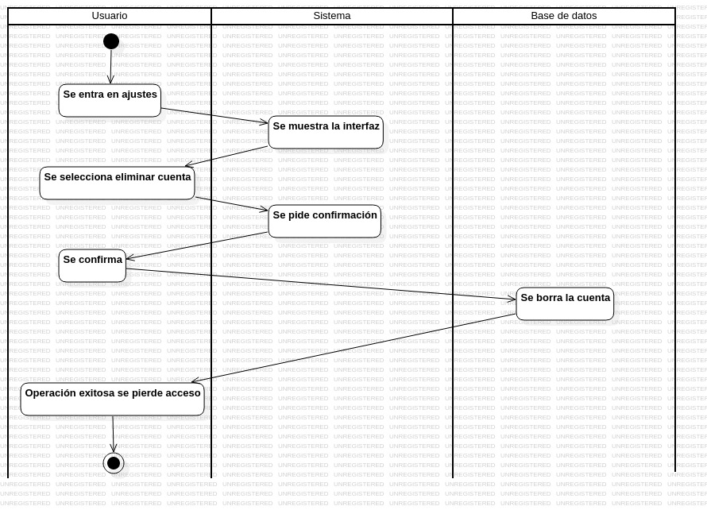
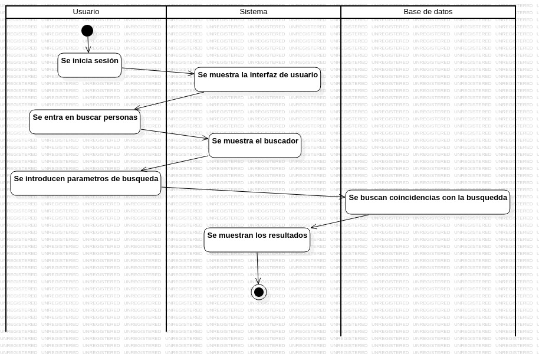
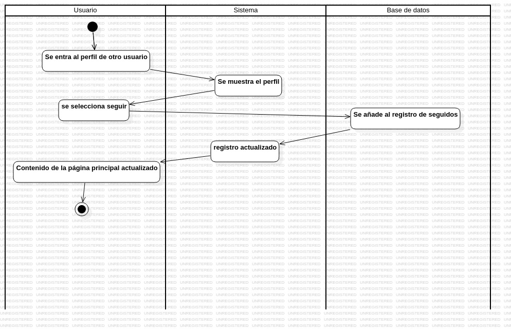
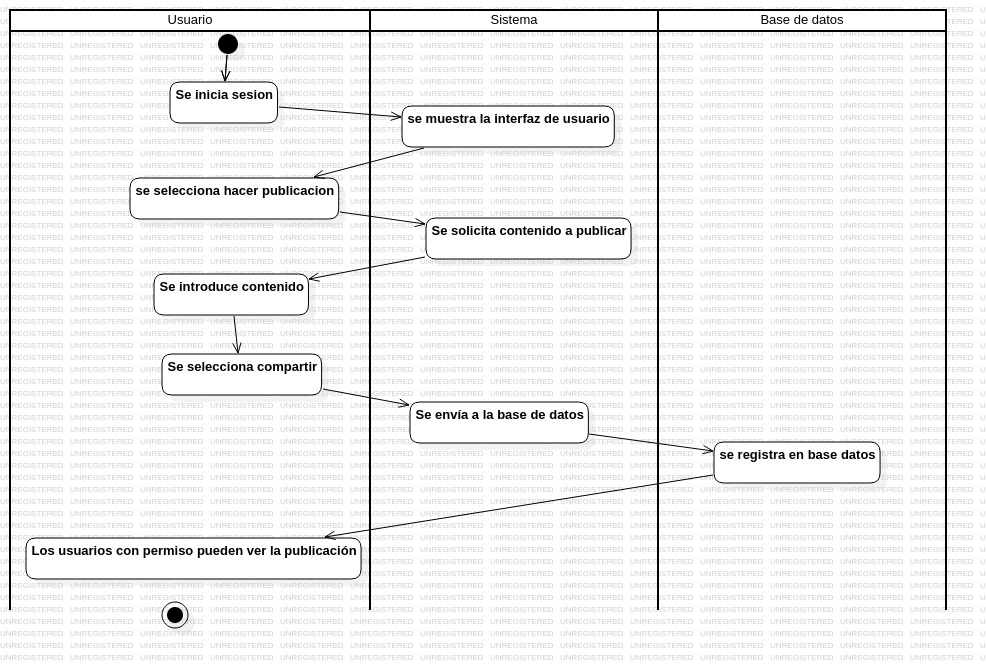
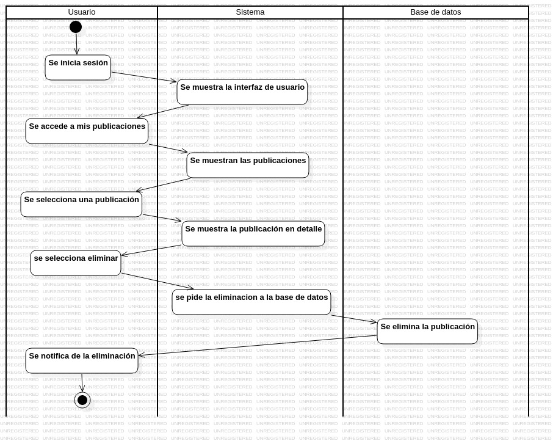
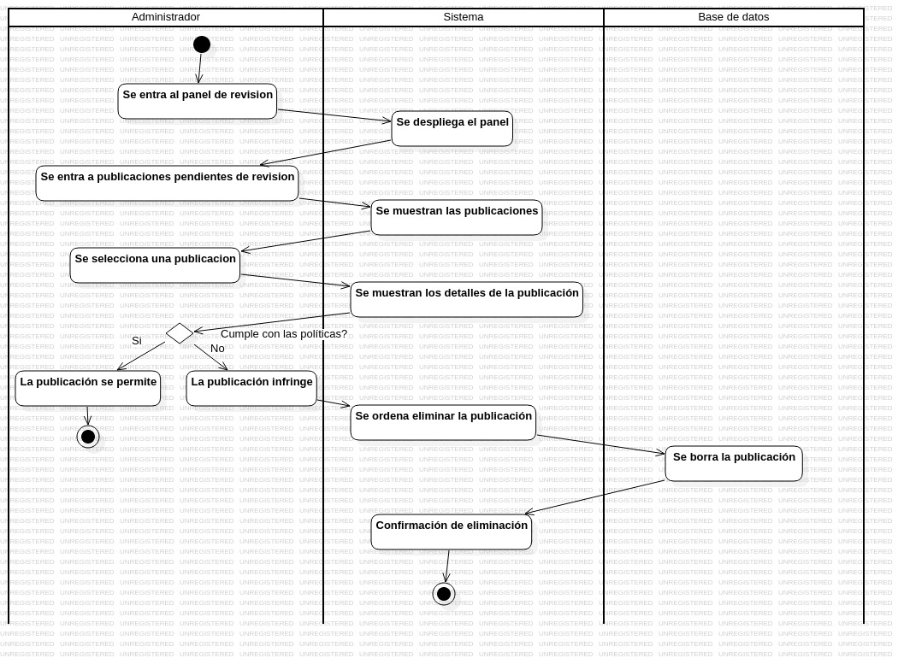
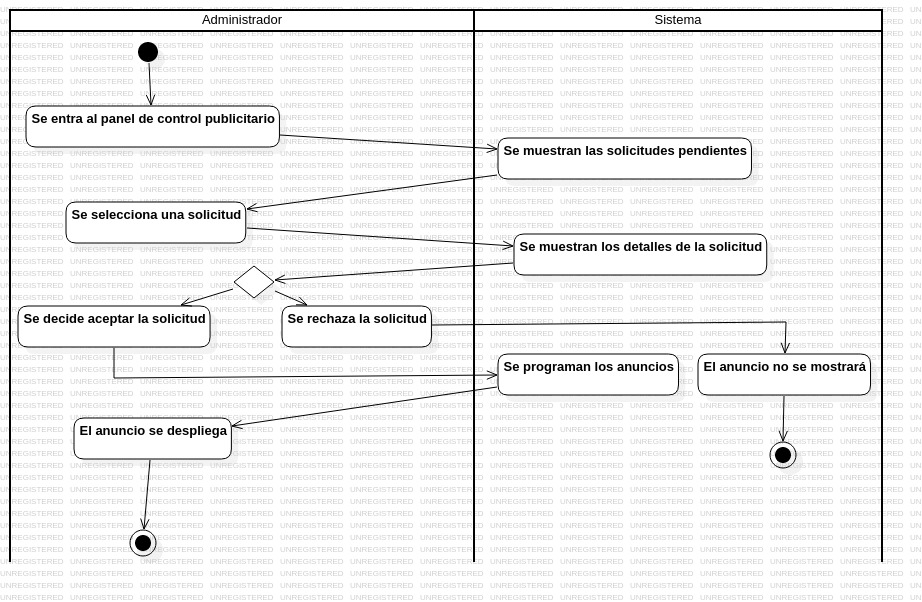

# 
Diagramas de actividades Red-social

## Registro

## Login

## Baja

## Buscar personas

## Seguir personas

## Publicar contenido

## Eliminar publicacion

## Revisa Contenido

## Control publicidad

