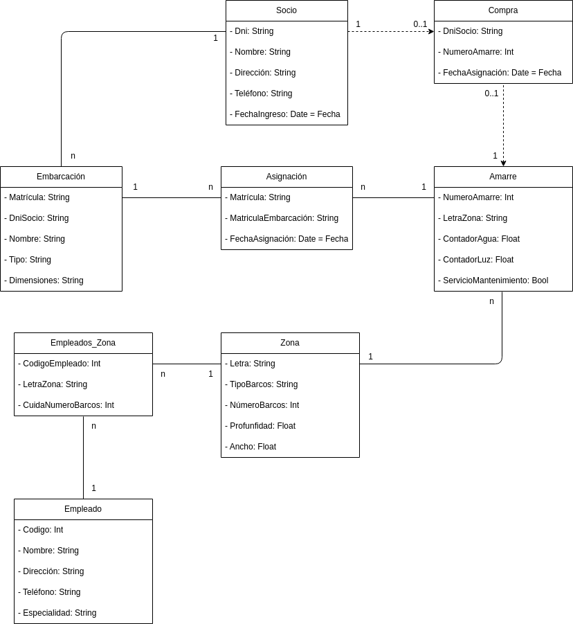

# 
Diagrama de Clases Club Náutico

## Puntos Importantes
Es necesario que un socio pase por una compra para poseer un amarre de ahí que se utilicen flechas discontinuas. Por otra parte, no es obligatorio realizar una compra en el club náutico de un amarre por lo que se establece un rango (0..n), para las compras, siendo 0 que no se ha comprado y 1 o más (n) el número de compras que ha hecho. Lo mismo para los amarres, un amarre se puede haber comprado o no (0..1).

Además, es importante poner una tabla intermedia entre zona y empleado, que nos relacione ambas tablas de forma correctas, ya que pueden trabajar muchos empleado en una zona al igual que un empleado puede trabajar en varias zonas.

