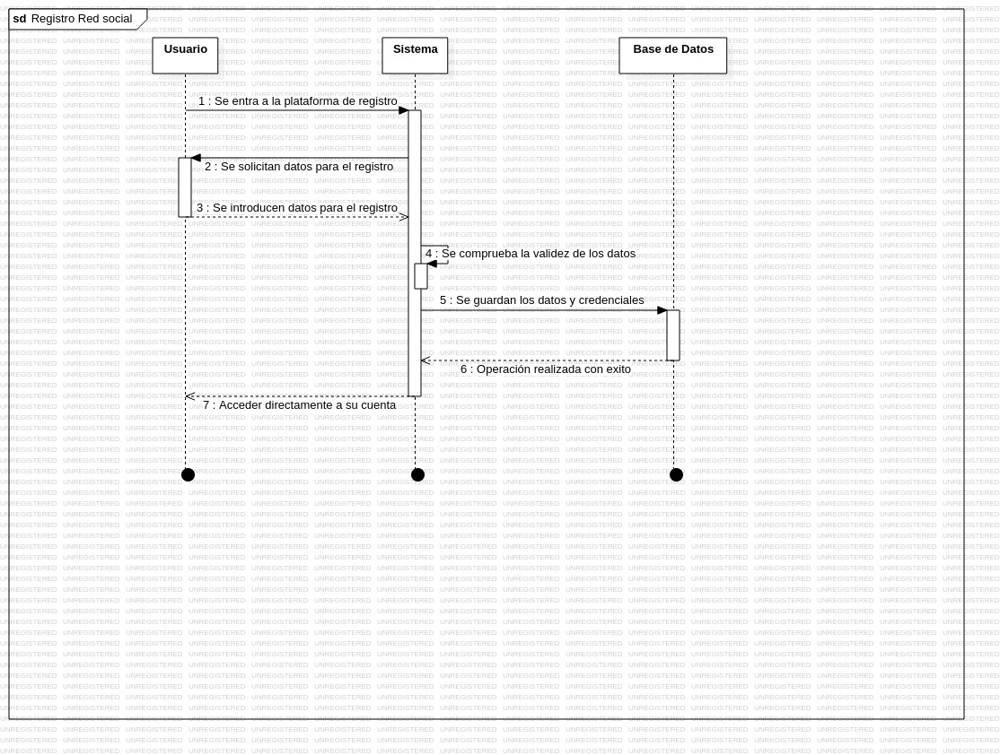
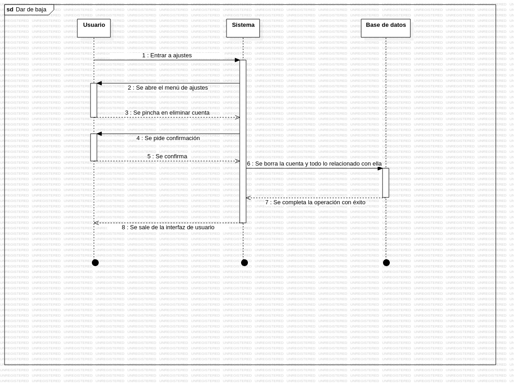
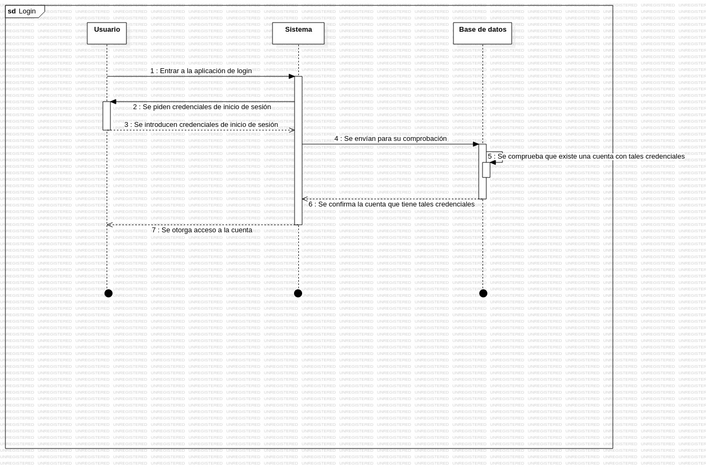
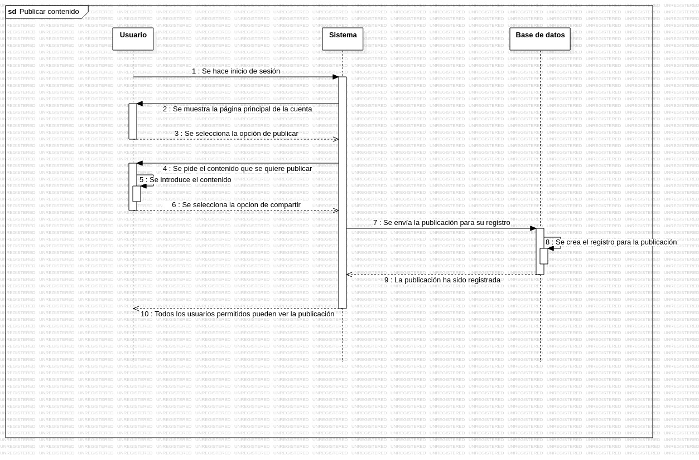
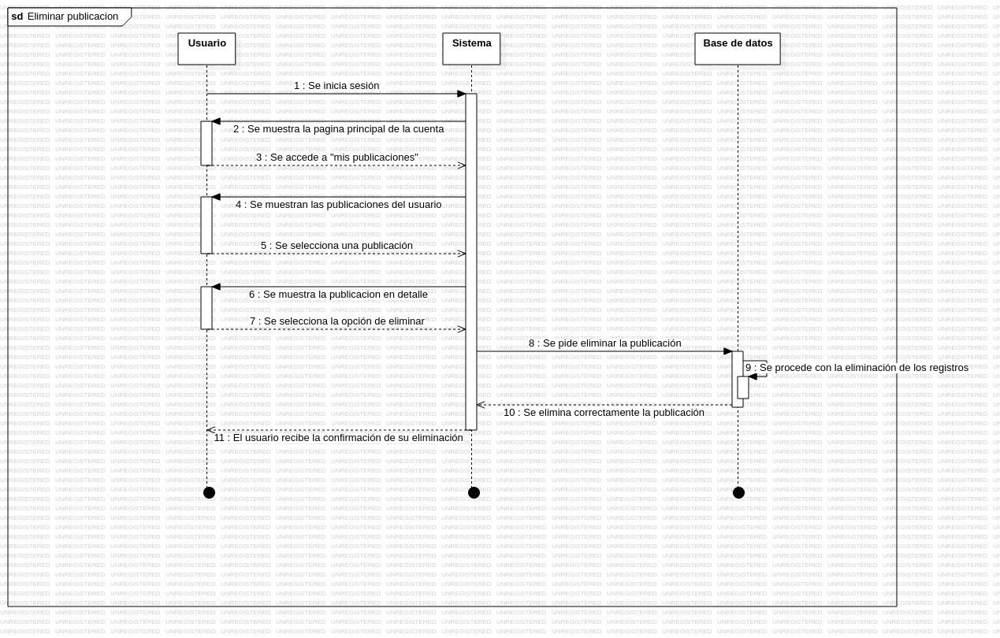
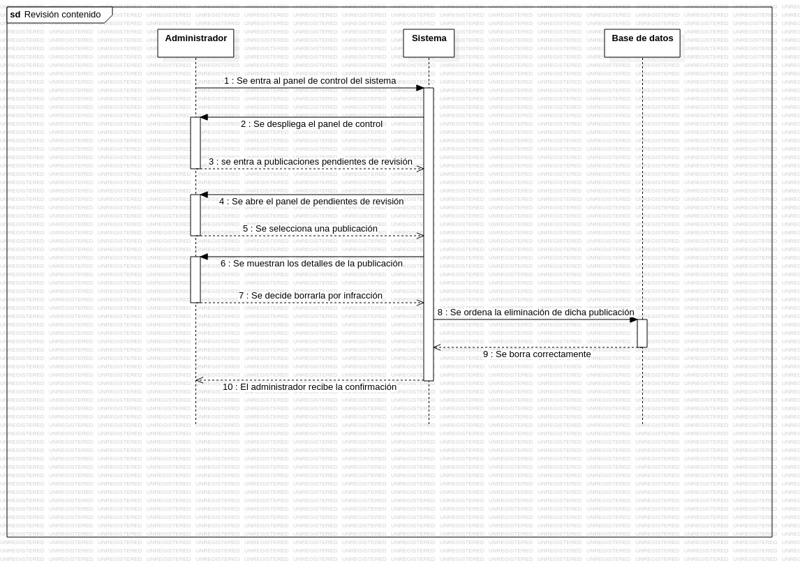
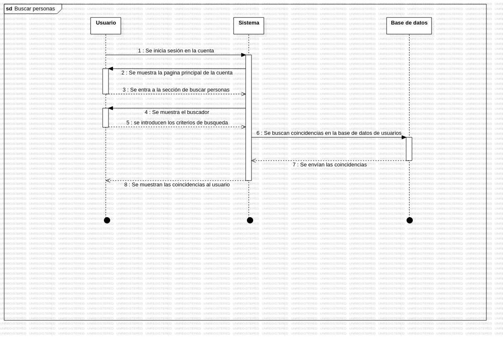
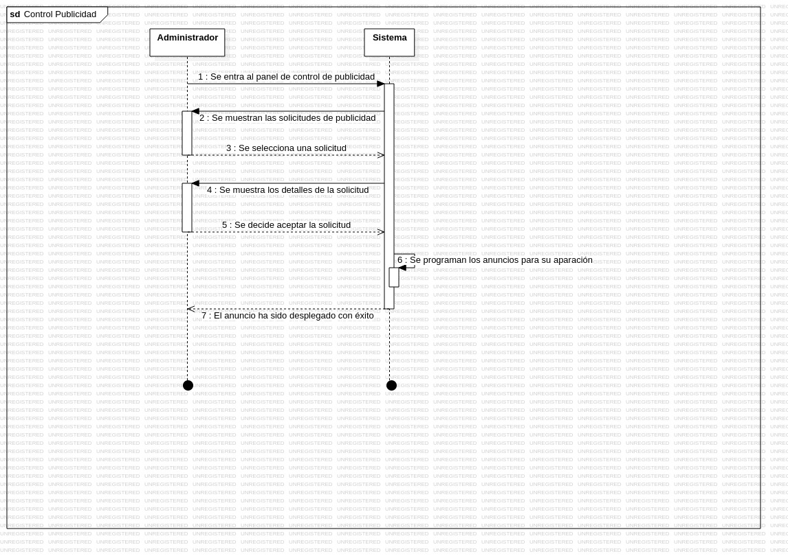

# 
Diagramas de secuencia Red Social

## Registro

## Baja

## Login

## Publicar

## Eliminar publicación

## Revisar contenido

## Buscar personas

## Seguir personas

## Control publicidad

