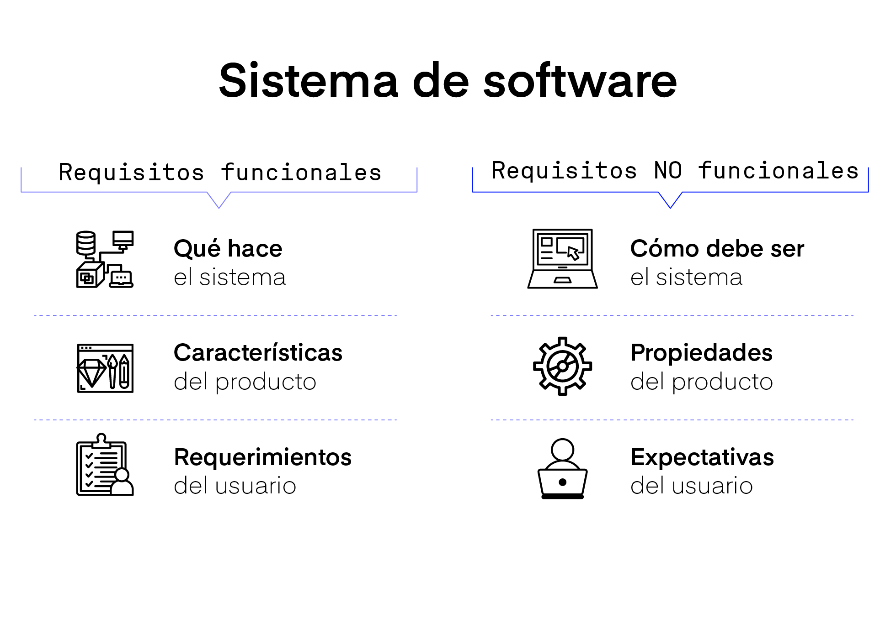
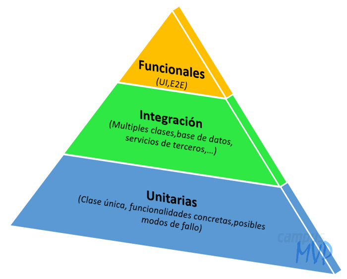
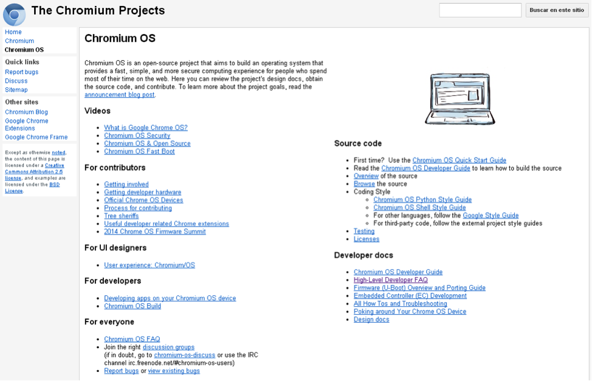

# 
Etapas de desarrollo del software

## Es recomendable ver este video:

## Análisis de requisitos:

### Los requisitos funcionales
- Estos requisitos son los que se relacionan con lo que hará nuestro software, como reaccionará a lo que reciba, sea por parte del usuario, de otro software, etc.
### Los requisitos no funcionales
* Estos son los requisitos relacionados con cómo el software hará lo que se le mande. Esto englobaría al propio comportamiento del producto, incluyendo también dentro de esta categoría cantidad de memoria utilizada, velocidad de ejecución, fiabilidad, seguridad protocolos de actuación o actuar dentro de los límites legales, entre otros.

## Diseño

En la fase de diseño una vez dispongamos de toda la información de la fase anterior realizaremos una serie de pasos para confeccionar nuestra base de datos:
1. Componer la estructura de la Base de Datos: Realizaremos un diseño acorde a nuestras necesidades para acceder a los datos necesarios.
2. Lógica del flujo de datos: Esto nos permitirá trazar el flujo de información que va a seguir nuestro programa.
3. La interfaz de usuario: Diseñaremos una interfaz intuitiva para los usuarios, que harán uso de nuestro software, intentando simplificarles todo lo necesario la interacción con nuestro software.

## Codificación y compilación

Escogeremos el lenguaje de programación con el que nos sintamos más cómodos, pero que además sea un lenguaje de programación adecuado para realizar la tarea que tenemos por delante y así conseguir crear nuestro programa. Es decir, la clave está en el equilibrio, entre lo que a nosotros se nos de bien como programadores y el lenguaje adecuado para la tarea específica.

## Pruebas

Cuando se trata de desarrollo de software y más cuando se trabaja en grupo, debemos tener en cuenta que antes de entregarle un producto al usuario final debemos cerciorarnos de que todo funcione en conjunto de forma correcta, para ello tenemos las pruebas:
### Pruebas unitarias
Una prueba unitaria sería aquella que se hace de forma aislada, sobre una parte del software, por ejemplo una clase o una función. Al realizarlos de esta manerea, si nuestro programa tiene un problema justo en ese lugar lo podremos encontrar de forma más rápida, ya que no hace falta revisar todo el software, solo una parte. Nos permiten evitar arrastrar errores.
### Pruebas de integración
Una prueba de integración es una que se hace sobre todo el programa, es una prueba muy importante, sobre todo si somos varios trabajando en el equipo, pues a la hora de juntar todo el trabajo se pueden producir problemas que por separado (En las pruebas unitarias) no habríamos podido ver, por ejemplo al interactuar diferentes partes que se hicieron por separado el programa puede que funcione de una forma no deseada o que direcamente ni lo haga.

## Explotación

Esta es la fase en la que preparamos el software para distribuirlo, por ello debemos implementarlo en el sistema elegido, o si esta preparado para ello dejar que se autoimplemente. Y, por supuesto debemos sacarlo a distribución, donde el público ya tendrá acceso al mismo.

## Mantenimiento

El manteniento es lo que se deberá hacer de forma continua tras lanzar el software a distribución, existen varios tipos dedicados a varioos fines:
### Adaptativo
Consiste en mejorar el programa y adaptarlo a los avances tecnológicos y tendencias.
### Correctivo
Consiste en arreglar problemas que surjan con el mismo y que no se detectarion ni corrigieron durante el desarrollo, o que hayan surgido a posteriori tras una actualización.
### Perfectivo
Busca perfeccionar el programa y añadir mejoras.
### Preventivo
Busca mejorar la manera en la que se usa el programa o añadir nuevas formas de usarlo.

## Documentación

Siempre hay que dejar registro del proceso de desarrollo, de esquemas, diagramas, cambios, etc. Por otra parte debemos crear un manual de usuario y técnico, pues las demás personas deben saber también como usar el programa que hemos creado.
### Manual de Usuario
El manual de usuario es algo muy importante, pues es la manera que tenemos de explicarle a este como usar correctamente nuestra obra. Un mal manual puede conducir a que el usuario tenga una mala experiencia con el producto.
### Manual Técnico
El manual técnico está destinado a profesionales del sector y también es importante, pues en el se explican entre otras cosas, como hacer labores de mantenimiento o instalación, entre otros. Imaginemos que contratamos a un nuevo técnico para nuestro equipo de desarrollo, habría que enseñarle a trabajar con el software paraa hacerle mantenimiento, ahí es donde entra en juego nuestro manual técnico, de ahí su importancia.

