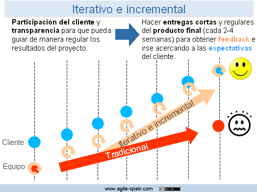
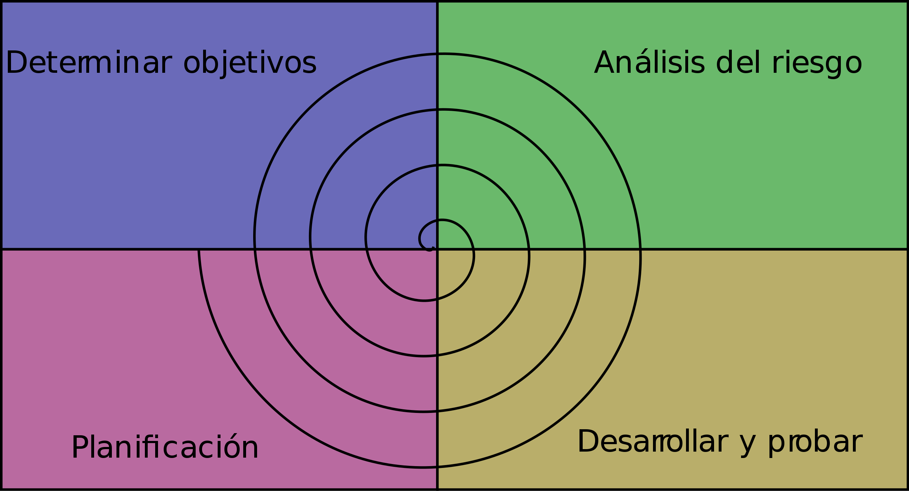

# 
Tarea 2 de Markdown

## Modelo en cascada
El modelo en cascada es un modelo que se basa en realizar una etapa tras otra de forma rigurosa, de tal manera que hasta que no acabe una no se puede pasar a la siguiente.

## Modelo en cascada con realimentación
Este modelo es igual al modelo en cascada pero permite una retroalimentación entre etapas, permitiendo una ventada de oportunidad a través de la cual realizar cambios en alguno de los pasos anteriores.

## Modelos evolutivos
Los modelos evolutivos son una categoría de modelos más permisivos en lo que respecta a trabajar en las etapas. Funcionan al contrario que los modelos en cascada

### Modelo interactivo incremental
Este modelo se creó en respuesta a las debilidades que presenta el modelo en cascada. Este modelo se basa en agrupaciones de tareas que se van realizando en etapas de desarrollo pequeñas y que se repiten constantemente, a lo largo del desarrollo del software. Al final el resultado es bastante más completo ya que mejora la adaptabilidad del desarrollo.

### Modelo en espiral
En este modelo de desarrollo se reparten las tareas en una forma espiral, siendo cada bucle de la misma una repetición de las etapas de desarrollo, pero con diferentes tareas. Las tareas, no se seleccionan todas desde el principio del desarrollo sino que se van repartiendo en las espirales según avanza el desarrollo, con la distribución que se crea conveniente según los criterios establecidos por el equipo

### Modelos ágiles
Este modelo está basado en el anterior que ya vimos, el iterativo incremental. Se basa principalmente en que los requisitos y soluciones que pretende tener y ofrecer ese software, respectivamente, se pueden ir moldeando con el tiempo. Al igual que los otros modelos, este también cuenta con una serie de etapas de desarrollo que se van repitiendo. Es un modelo ideado principalmente para equipos multidisciplinarios. El modelo también cuenta con otra característica, esta es que los desarrolladores, o al menos eso se espera, estén en contacto continuamente con el cliente para saber si existen nuevos requisitos para el programa, sea cual sea la razón.

## Video orientativo

